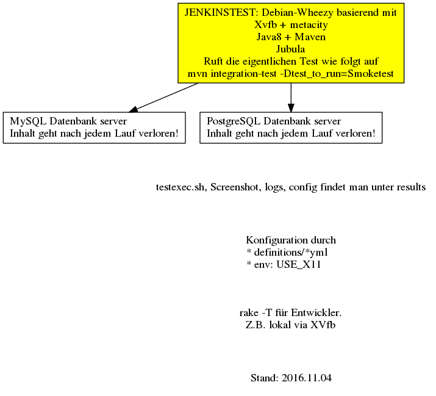

{toc:style=disc|maxLevel=3}

# Jubula GUI tests for Elexis 3.1

Here Niklaus tries to make a new, better environment for running the Jubula GUI-tests.

## Requirements

* docker-compose
* docker
* maven
* Java-8
* rubygems pg libpq-dev

## Continuos integration

Have a look at the "Jubula-Matrix":https://srv.elexis.info/jenkins/job/Elexis-3.0-Jubula-Matrix-Linux/ on elexis.info.

The tests there are running all inside a docker container `ngiger/jubula_runner`, which has all the needed programs. Tests may use the MySql and PostgreSQL database, where the user `elexis` (with password elexisTest) got granted unlimited rights to the database

There are some rake task (shown via `rake -T` or more verbose `rake -D`) to facilitate some stuff, which would have take much longer via Java.

## concepts

### config variables for the Java main class AUT_run

The following config entities can be changed via an environment variable or a Java system property. The default values are show here:

- aut_id := `elexis`
- work_dir := `/opt/src/elexis-jubula/jubula-tests`
- agent_host := `localhost`
- aut_keyboard := `de_DE`
- aut_exe := `/opt/src/elexis-jubula/work/Elexis3`
- agent_port := `6333`
- aut_vm_args := `-nl de_DE -clean -vmargs -Declipse.p2.unsignedPolicy=allow -Dautagent_port=6333 -Dautagent_host=localhost -Dch.elexis.username=007 -Dch.elexis.password=topsecret  -Delexis-run-mode`

### config variables for the rake 

Config-Variables are accessed via the Hash Config and stored as follows:

* "defaults.yaml":defaults.yaml default definition which common for all tests
* "config.yaml":config.yaml (not in git), let you override the default
* for test, e.g: "definitions/Screenshot.yaml":definitions/Screenshot.yaml let you control how the tests are run. They are read when a test is executed. At the moment it is not possible to  include another yaml file. The usually contain
** :autrun_params, e.g. `"--kblayout de_CD --autid elexis -rcp"`
** :testexec_params: e.g. `"-autid elexis -version 1.0 -language en_US -project Screenshot -testsuite ScreenSuite"`
** :aut_vmargs: e.g.
bc. "-DdbOpts=h2 -Delexis-run-mode=RunFromScratch
-Dch.elexis.username=007 -Dch.elexis.password=topsecret
-Declipse.p2.unsignedPolicy=allow -Dorg.eclipse.swt.browser.DefaultType=mozilla"

We will probably soon add a possibility to add a specific command before a test execution, eg. to download a file.

Setting the environment variable VARIANT allows changing the download location for installing the Elexis OpenSource for the Beta, PreRelease and Release versions.

## notes

### Why we do NOT install Jubula in the docker

The following arguments were in favor:
* Once the docker images is created, running the tests would be easy
* Installing only the autagent did not work (the plugins directory was missing)
* Running autrun on the host it was not possible to start Elexis inside the container

The following arguments were against:
* Jubula 8.2 is quite large (almost 900 MB) after the installation. We are able to zip the needed autagent to about 55MB.
* We want to install Jubula only once on the target host
* As moved to using the "ClientAPI":http://www.bredex.de/blog_article_en/jubula-client-api.html we could get rid of using dbtool, etc. See also "Writing Jubula test in Java":https://www.eclipse.org/community/eclipse_newsletter/2015/july/article3.php
* It proved easy to build a autagent for all our supported environments. It is only necessary to add the `-vm /usr/bin/java` to avoid `No Java virtual machine was found`

### testing inside docker

If you have ruby installed, run once `gem install bundler && bundle install --without debugger && rake docker_build`. Then call `rake docker_build_run`.

To run a testsuite e.g. Screenshot just call `rake run_inside_docker Screenshot`. Insure that you got a nice screenshot under results/images/ before proceeding to more complex tests.

As the Jenkins-CI often hand problems we followed https://wiki.jenkins-ci.org/display/JENKINS/Spawning+processes+from+build and added daemonize binary from 1.7.7 from http://software.clapper.org/daemonize/.

### Special considerations for running inside docker

It took my quite a few hours to overcome the following problems
* Neither fluxbox nor awesome were window manager which allow (at least not without furter modification) to connect to the AUT (calling app.activate(AUTActivationMethod.titlebar) failed or hanged)
* metacity seems to work, but need another 100 MB. Is starting the dbus the difference?
* in november 2016 we moved to use docker-compose to run tests against MySQL and Postgres (docker) databases
* When calling start_agent via shell script inside the docker, m_agent.startAUT(aut_config) failed and blocked
* When I invoked `system` inside rake when call rake jubula_docker, starting the AUT failed, too.
* We set the environment variable HOST_UID to the uid of the process calling docker-compose, which will be used for the user elexis in the container.
* Calling directly `scripts/jubularunner.rb run_in_docker Screenshot` blocked also
* Calling `rake jubula_docker` worked
* We ran the docker in in a Debian (Jessie) homes, which had docker-engine 1.12.3 and docker-compose 1.7.0 installed. Additionally the following code was run
-bc. apt-get install -y docker-engine docker-compose bundler maven xvfb

* If you want to watch the screen output inside the docker, you have
** set environment variable USE_X11
** uncomment the 3 lines in wheezy/docker-compose ending with USE_X11
** To start a new X server from within an already running X session, you need to run 'dpkg-reconfigure x11-common' and choose option 'anybody'.

### Object mapping

I always had a hard time to find that Ctrl-Shift-Q (default was Ctrl-Shift-A) was the default key to collect a compontent from Elexis. This is configured under Preferences..Test..Object Mapping

### keyboard bindings

On December 5 2015 I tried to add a keyboard binding file for de_CH, but I am not sure whether it worth the time. Because when I configured my KDE workspace to use a swiss german keyboard, most of the the tests passed when using the US keyboard in the AUTConfiguration. What did not work where the german Umlauts. Maybe we will be better off to just not use these characters in our test and warn about it in methods like Common.synchronizedTextReplace

### target definition

I just copied org.eclipse.jubula.project.configuration/target/definitions/jubula+nightly.target to jubula-target/jubula-target.target and added the following location

bc. <location includeAllPlatforms="false" includeConfigurePhase="false" includeMode="slicer" includeSource="true" type="InstallableUnit">
<unit id="org.eclipse.jubula.feature.feature.group" version="0.0.0"/>
<unit id="org.eclipse.jubula.feature.api.feature.group" version="0.0.0"/>
<unit id="org.eclipse.jubula.feature.api.source.feature.group" version="0.0.0"/>
<repository location="http://download.eclipse.org/jubula/nightly/repo"/>
</location>

### Upgrading to a newer version of Jubula

The following steps are needed.
* Update jubula_root and jubula_version in scripts/defaults.yaml to the new version
* Replace assets/rcp-support.zip by the locally downloaded new version, e.g. /opt/jubula_8.2.2.050/development/rcp-support.zip

# developping new tests

The most convenient method for me is to use the Jubula feature to run the AUT on a different host (a VirtualBox) than the test. This allows breaking anywhere in the test code, stepping, etc. without interfering with my keyboard clicks and being able to see the AUT-GUI.

The following steps were needed
* Run my favorite Eclipse-IDE on my desktop (localhost)
* Booting a Virtual Machine with Debian Wheezy (hostname is wheezy)
* `git clone git`github.com:ngiger/elexis-jubula.git /same/path` on both my localhost and wheezy
* on wheezy
** `cd /same/path && mvn clean install`
** Install the Elexis to be tested in the subdirectory work either
*** by any method you are familiar with (and install the Jubula rc.rcp support) or
*** `cd /same/path && rake elexis_install_os`
** In a terminal of the wheezy GUI call `cd /same/path && org.eclipse.jubula.product.autagent.start/target/products/org.eclipse.jubula.product.autagent.start/linux/gtk/x86_64/autagent -vm /usr/bin/java -l -p 6333&`
* On the localhost
** Import the elexis-jubula test
*** Set a breakpoint in the method `openMenu` in `jubula-tests/src/ch/ngiger/jubula/helpers/Common.java`
** Open the menu "Run/Debug Configuration..". 
*** Select the JUnit target Elexis_Jubula. Verify that in the tab
*** Select the Test class to the test you want to run, e.g. `ch.ngiger.jubula.testsuites.Smoketest`
*** In the tab "Arguments" set "VM arguments" to `-Dagent_host=wheezy`
*** Choose Debug. If everything is okay it will connect to the autagent, start Elexis and begin executing the tests, which will quite soon open a menu.
* To use a specific database and a file to be loaded before executing the test you must
** Have a database to connect
** The database user elexisTest with password elexisTest must have full privileges for the given database!
** Add to "Run/Debug Configuration.." in the tab "Arguments" to the vmargs the value `-Ddb_connection="jdbc:postgresql://server:port_nr/db_name"`
** (optionally)
***Have a SQL file which loads the whole database, if not given the RunFromScratch parameter will be specified
*** Add to "Run/Debug Configuration.." in the tab "Arguments" to the vmargs the value `-Ddb_load_script=my_dump.sql`. The file specified must an absolute path or be
relative to the jubula-tests/rsc/db/<type_of_db> subdirectory.
** Postgres: A dump file will only be generated if server and client use a matching postgres version.

## TODO

The following improvements are planned. Order may be varied depending whether we will encounter unforeseen problems.

### Catch up with previous capabilities

* Test upgrade

### pending improvements

* Artikelstamm
** Show migration of legacy (stock, billing)
* -Test whether we are able to input umlauts and other special characters-
* Complete basic tests until we can prove that Elexis creates correct bills
* Checking upgrade of older databases (real, but anonymized ones!)